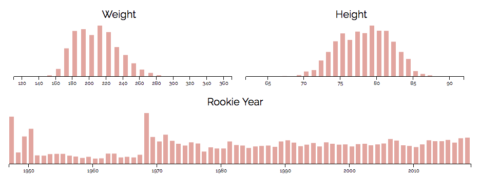
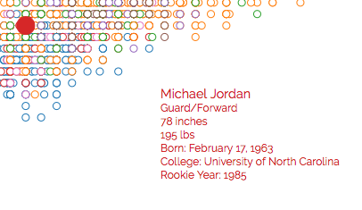

# NBA Height vs Weight
NBA Historical Height vs Weight Interactive Scatter Plot

## Overview

Interactive scatter plot including all 4550 players to have ever played in the NBA dating back to 1947.
The players are plotted using their height (inches) and weight (lbs).

## Details
The plot can be filtered by a player's height, weight, or rookie year, implemented using Crossfilter.js.

When hovering over a player, a player's additional information can be seen on the plot.

Using jQuery UI's autocomplete widget, a player search has been implemented to search through the thousands of players.
When searching, simply press UP, DOWN, or double click on a player name to select the player, and the player will be highlighted on the plot.

Created using D3.js and data scraped from basketball-reference.com

## Thoughts
The creation of Built To Ball: Height vs Weight is currently being documented in a series of blog posts that can be found [here](https://medium.com/built-to-ball).

**Stage 1: Data Collection**: The essence behind every data visualization project is the data itself. As soon as I decided I wanted to spend my holidays building something unique to further explore my new found interest of data visualization, I began to look for the perfect dataset. [Read More...](https://medium.com/built-to-ball/the-making-of-built-to-ball-e39dba7bbfa2)

**Stage 2: Data Playground**: With a data file of over 4500 records, I needed a way to visualize all of the data at once. The first thing I made was a simple D3 scatter plot, allowing me to jump right into the data while also providing a way to ease into the D3 world with a refresher on JavaScript. [Read More...](https://medium.com/built-to-ball/stage-2-playing-with-data-10524ed210ff)
